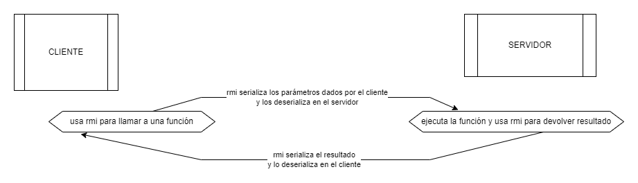
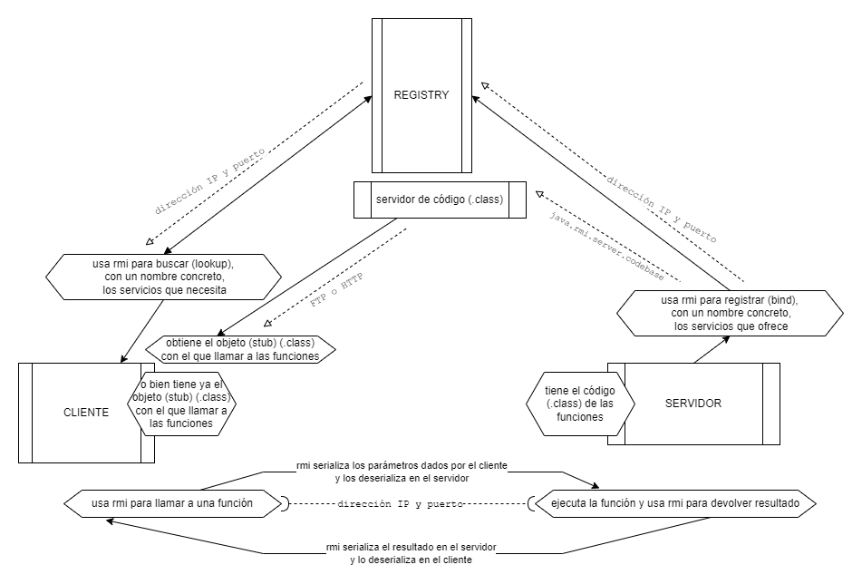

# Java RMI

Reduciendolo a lo esencial, RMI permite:

- A un servidor "anunciarse" en un registro de servicios.

- A un cliente "encontrar" el servicio que necesita y llamarlo como si estuviera usando una función de una biblioteca local.

De esta manera, un proceso en una máquina (cliente) puede ejecutar funciones que realmente se ejecutan en otro proceso o en otra máquina (servidor). Estando conectados ambos a través de una red de comunicación.

## Lo que Bing-GPT indica acerca de los usos de RPC

“Remote Procedure Call (RPC) is a protocol that allows a program to request a service from another program located on another computer in a network without having to understand the network’s details. RPC is used in distributed systems to allow communication between nodes and can be a good solution for specific interactions between nodes where APIs can be defined for specific operations (1).

RPC can help developers use familiar practices in the unfamiliar world of distributed computing by emulating local procedures (2). However, there are challenges when introducing RPC within a distributed software system, primarily related to issues with state management and underlying call logic (2). Translating a local procedure call to an RPC without considering state requirements can easily break an application (2).”

(1) (https://stackoverflow.com/questions/47602517/messaging-vs-rpc-in-a-distributed-system-openstack-vs-k8s-swarm)

(2) (https://www.techtarget.com/searchapparchitecture/tip/The-architectural-impact-of-RPC-in-distributed-systems)
(https://aws.amazon.com/builders-library/challenges-with-distributed-systems/)

## Forma básica de trabajar

- Preparar **la funcionalidad** que se quiere ofrecer como servicio:

  - La definición de funciones va en un interface que extiende _java.rmi.remote_
  - La funcionalidad va en una clase que implementa ese interface.

- Preparar **el servidor** que va a ejecutar la funcionalidad:

  - Crea el stub. Usando la clase con la funcionalidad y llamando al método _java.rmi.server.UnicastRemoteObject.exportObject()_

  - Lo registra. Llamando al método _.bind()_ del Registry. Este registro se hace con un nombre concreto (\*).

- Preparar **el registro de servicios** que va a permitir a los clientes encontrar a los servidores. Se trata simplemente de arrancarlo en alguna máquina de la red; este arranque se puede hacer más o menos manualmente con el comando _start registry_ ; o bien se puede hacer desde código llamando al método _java.rmi.registry.LocateRegistry.createRegistry()_

- **Los clientes** hacen uso de la funcionalidad:
  - Adquieren la información que necesitan para acceder al servicio (dirección IP del servidor, puerto en que este está escuchando y el "stub") . Llamando al método _.lookup()_ del Registry; buscando con el nombre concreto (\*) correspondiente.
  - Utilizan el "stub para llamar a las funciones correspondientes. Estas llamadas son como si fueran llamadas a funciones locales de una biblioteca o de un objeto local; (rmi se encarga de todas las comunicaciones involucradas)

## Stub

Es un "representante" de la función que se desea ejecutar de forma remota.

- En el cliente se usa el stub para llamar a la función. El stub se encarga de redirigir esa llamada (y los parámetros serializados) hacia el servidor donde se va a ejecutar realmente.

- En el servidor se usa el stub para recibir la llamada (y los parámetros deserializados). Tras ejecutarse la función y obtener unos resultados. El stub se encarga de serializar esos resultados y devolverselos al cliente.

De esta forma, tanto el cliente como el servidor tienen la impresión de estar trabajando con una función local. Con parametros de llamada y de retorno como si fueran objetos locales.

### Cómo puede un cliente obtener el stub

El stub son los .class del interface y de su implementación. Un cliente tiene dos formas de obtenerlos:

- O bien los tiene ya directamente en su propio CLASSPATH local.

- O bien los descarga de forma dinámica desde la red, según localiza el servicio en el Registry. La descarga se suele hacer desde un servidor FTP o HTTP; en la URL indicada en la propiedad _java.rmi.server.codebase_ utilizada por el proveedor del servicio al registrar este.

## Registry (el Registro de Servicios)

Es un servicio especial que permite a los clientes buscar los servicios RMI que hay disponibles en la red donde se esté trabajando. (Obviamente, los servidores que proveen dichos servicios han tenido que registrarlos previamente en ese registro.)

Al consultar en el registro un servicio concreto, el registro se encarga de:

- Indicar al cliente en qué servidor se encuenta ese servicio (dirección IP y puerto).
- (opcional) Proporcionar al cliente la URL desde donde puede descargarse el _stub_ que necesita para llamar a ese servicio.

Antes de poder trabajar con cualquier programa que use RMI (tanto servidores como clientes). Se ha de tener activo en la red el registro de servicios que se vaya a utilizar.

Se puede encontrar usando el método:

    java.rmi.registry.LocateRegistry.getRegistry()

nota: Si no está activo el registro, al ejecutar el programa (cliente o servidor) dará un error de este estilo:

    java.rmi.ConnectException: Connection refused to host: xxx.xxx.xxx.xxx

### Activar un Registry desde línea de comandos

Lanzar el comando

    start rmiregistry

nota:(https://docs.oracle.com/en/java/javase/20/docs/api/java.rmi/java/rmi/registry/LocateRegistry.html)

¡Atención!, el registro necesita saber donde están los stub (los .class de sus interface/implementación); la ubicación de esos .class ha de estar en el CLASSPATH de la JVM donde esté corriendo el registro. Sino dará un error de este estilo:

    java.rmi.UnmarshalException: error unmarshalling arguments; nested exception is:
        java.lang.ClassNotFoundException: xx.yyyyyyyy.ZzzzzzZzzzzZzzz

Para ello se puede lanzar el comando _start rmiregistry_ estando situado justo en la carpeta madre de donde están los .class de los servicios registrados (la madre justo antes de las "subcarpetas de package" xx.yyyyyyyy).

### Activar un Registry desde código

Usando el método:

    java.rmi.registry.LocateRegistry.createRegistry(1099);

La ventaja de este segundo método es que no nos hemos de preocupar por el CLASSPATH, ya que estaremos activando el registro en la misma JVM de nuestro programa. Y, por tanto, con su mismo CLASSPATH.

nota: El puerto por defecto de RMI es el 1099. Pero se puede utilizar cualquier otro, (indicandolo adecuadamente donde corresponda al utilizarlo, claro está.)

# Apéndice: principales usos donde merece la pena utilizar RPC

nota: [A high performance, open source universal RPC framework: gRPC](https://grpc.io/)

nota: _Esta es la perspectiva de alguien novato en esto del RPC. Es posible que algunas de las opiniones indicadas aquí no sean correctas o que falten partes importantes._

RPC es útil allá donde se necesite:

- Algo sencillo de utilizar. Ya que es muy parecido a llamar a funciones locales.
- Algo rápido y ágil. Ya que requiere poca infraestructura intermedia.
- Algo para resolver necesidades específicas y concretas, entre partes conocidas y estables.
- Algo que responda (o que falle) en el mismo momento en que se invoca (RCP es síncrono).

Algunos usos típicos:

- Monitorización y control entre las distintas partes de un sistema distribuido.

- IoT, interacciones entre pequeños dispositivos en la periféria y los sistemas de control que los gobiernan.
