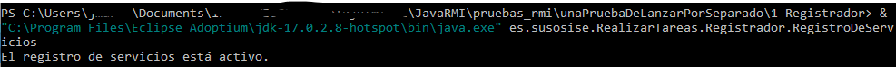
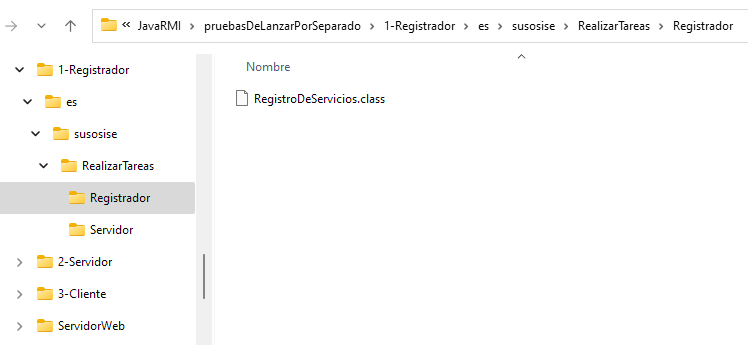
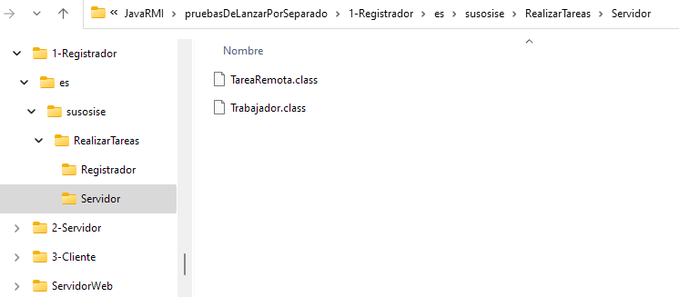
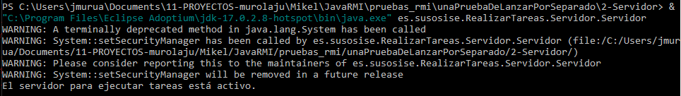
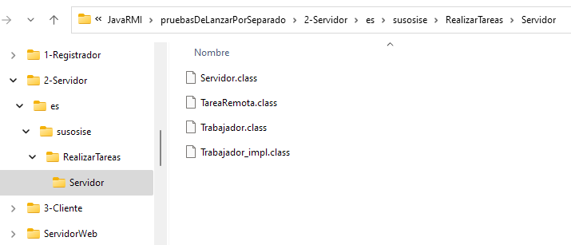
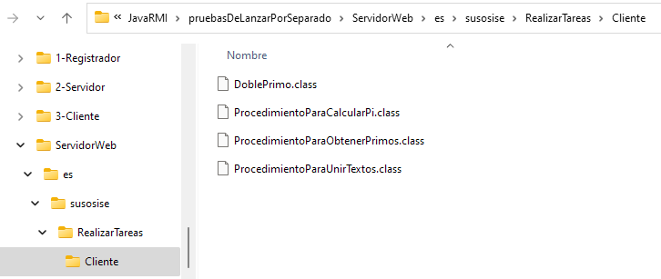
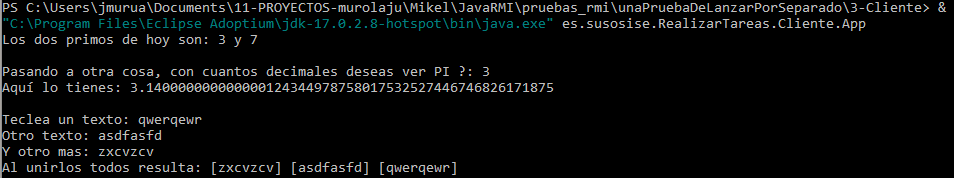
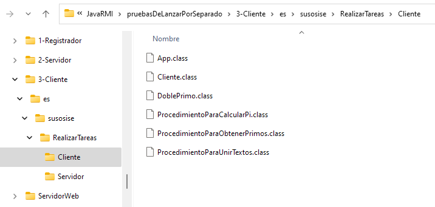
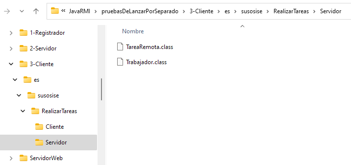
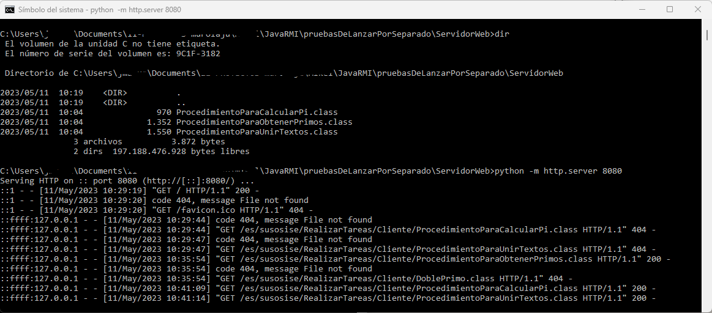

# Servicio de ejecución remota de tareas

Se trata de preparar un servidor al que los clientes puedan encargarle ejecutar tareas.

El interface de tarea es fijo, para que tanto cliente como servidor sepan a qué atenerse:

    public interface EjecutarTarea extends Remote {
        <T> T ejecutarTarea(Tarea<T> tarea) throws RemoteException
    }

(nota: si no se conoce acerca de los "Generics" en Java, seria conveniente repasar ese tema; por ejemplo con este video https://www.youtube.com/watch?v=K1iu1kXkVoA)

La tarea a ejecutar la define el propio cliente, quien pone a disposición del servidor el código ejecutable (.class) de la misma.

El tipo del resultado `<T>` lo define también el propio cliente, quien pone a disposición del servidor la clase (.class) correspondiente si este tipo es un objeto y no un tipo nativo de Java.

El cliente ha de depositar esos .class en un servidor web. Para que el servidor pueda acceder a ellos.

## Para lanzar cada parte por separado

### El registrador

Para arrancarlo, estando en la carpeta raiz correspondiente, lanzar el comando:

> "C:\Program Files\Eclipse Adoptium\jdk-17.0.2.8-hotspot\bin\java.exe" es.susosise.RealizarTareas.Registrador.RegistroDeServicios

(nota: si se está fuera de la carpeta raiz correspondiente, usar el parámetro -cp para indicarla al arrancar la JVM)

Necesita tener sus propios .class y los .class de los Interfaz que se usan en los servicios RMI del servidor.

### El servidor

Para arrancarlo, estando en la carpeta raiz correspondiente, lanzar el comando:

> "C:\Program Files\Eclipse Adoptium\jdk-17.0.2.8-hotspot\bin\java.exe" es.susosise.RealizarTareas.Servidor.Servidor

(nota: si se está fuera de la carpeta raiz correspondiente, usar el parámetro -cp para indicarla al arrancar la JVM)

Solo necesita tener sus propios .class (que incluyen los Interfaz)

Mas los permisos correspondientes para el SecurityManager. Ya que en esta aplicación la JVM del servidor ha de cargar dinámicamente clases desde un servidor web externo a ella.

¡IMPORTANTE!. Para ejecutar las tareas que le encomienda el cliente. Ha de tener acceso a los .class de las tareas que ese cliente ha definido. Bien sea porque los tiene directamente en su CLASSPATH; o bien sea porque los puede cargar de forma dinámica desde un servidor web.

### El cliente

Para arrancarlo, estando en la carpeta raiz correspondiente, lanzar el comando:

> "C:\Program Files\Eclipse Adoptium\jdk-17.0.2.8-hotspot\bin\java.exe" es.susosise.RealizarTareas.Cliente.App

(nota: si se está fuera de la carpeta raiz correspondiente, usar el parámetro -cp para indicarla al arrancar la JVM)

Necesita tener sus propios .class y los .class de los Interfaz que se usan en los servicios RMI del servidor.

¡IMPORTANTE!, si se va a usar carga dinámica, quien haya definido las clases ha de preocuparse de que los .class correspondientes estén disponibles en el site web.

### El site web

Es quien sirve los .class para quien los necesite cargarlos de forma dinámica

Vale con cualquier servidor web sencillo. Tan solo ha de servir archivos para descargarlos con peticiones GET. Para pruebas podemos utilizar algo como el servidor web de desarrollo de Python (https://docs.python.org/3/library/http.server.html).

Para arrancarlo, estando en la carpeta raiz correspondiente, lanzar el comando:

> python -m http.server 8080

