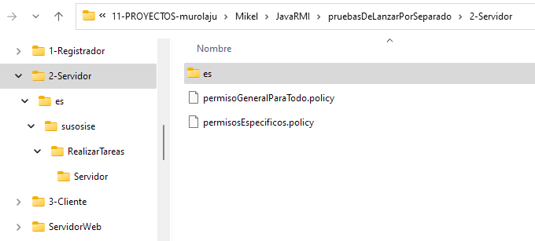

# Servicio de ejecución remota de tareas

Se trata de preparar un servidor al que los clientes puedan encargar ejecutar tareas.

El interface de tarea es fijo, para que tanto cliente como servidor sepan a qué atenerse:

    public interface EjecutarTarea extends Remote {
        <T> T ejecutarTarea(Tarea<T> tarea) throws RemoteException
    }

La tarea a ejecutar la define el propio cliente, quien pone a disposición del servidor el código ejecutable (.class) de la misma.

El tipo del resultado `<T>` lo define también el propio cliente, quien pone a disposición del servidor la clase (.class) correspondiente si este tipo es un objeto y no un tipo nativo de Java.

El cliente ha de depositar esos .class en un servidor web. Para que el servidor pueda acceder a ellos.

## Para lanzar cada parte por separado

### El registrador

Necesita tener sus propios .class y los .class de los Interfaz que se usan en los servicios RMI del servidor.

Para arrancarlo:

- Estando en la carpeta raiz correspondiente, lanzar el comando:

  "C:\Program Files\Eclipse Adoptium\jdk-17.0.2.8-hotspot\bin\java.exe" es.susosise.RealizarTareas.Registrador.RegistroDeServicios

(O sino se está en la carpeta raiz correspondiente, usar el parámetro -cp para indicarla al arrancar la JVM)

### El servidor

Solo necesita tener sus propios .class (que incluyen los Interfaz)

¡IMPORTANTE!. Para ejecutar las tareas que le encomienda el cliente. Ha de tener acceso a los .class de las tareas que ese cliente ha definido. Bien sea porque los tiene directamente en su CLASSPATH; o bien sea porque los puede cargar de forma dinámica desde un servidor web.

Para arrancarlo:

- Estando en la carpeta raiz correspondiente, lanzar el comando:

  "C:\Program Files\Eclipse Adoptium\jdk-17.0.2.8-hotspot\bin\java.exe" es.susosise.RealizarTareas.Servidor.Servidor

(O sino se está en la carpeta raiz correspondiente, usar el parámetro -cp para indicarla al arrancar la JVM)

### El cliente

Necesita tener sus propios .class y los .class de los Interfaz que se usan en los servicios RMI del servidor.

¡IMPORTANTE!, si se va a usar carga dinámica, ha de preocuparse de que los .class de las tareas estén disponibles en el site web.

Para arrancarlo:

- Estando en la carpeta raiz correspondiente, lanzar el comando:

  "C:\Program Files\Eclipse Adoptium\jdk-17.0.2.8-hotspot\bin\java.exe" es.susosise.RealizarTareas.Cliente.App

(O sino se está en la carpeta raiz correspondiente, usar el parámetro -cp para indicarla al arrancar la JVM)

### El site web

Es quien sirve los .class para quien los necesite cargarlos de forma dinámica

Vale con cualquier servidor web sencillo. Para pruebas podemos utilizar algo como el de Python:

Para arrancarlo:

- Estando en la carpeta raiz correspondiente, lanzar el comando:

      python -m http.server 8080

